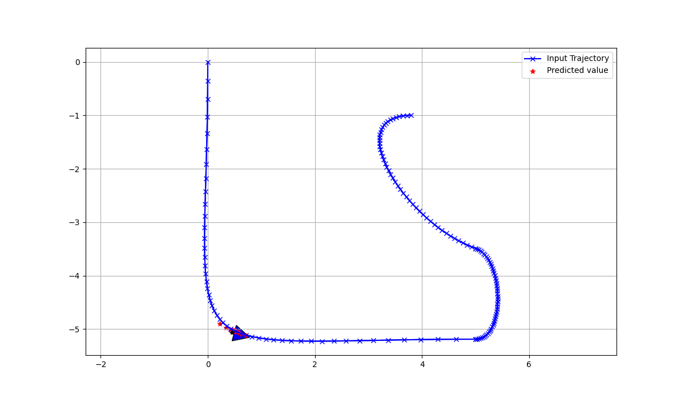

# PathTracking
This repository is used for sharing all the PathTracking method.

# Dependencies
1. Casadi
2. NumPy
3. Matplotlib
4. BeizerPath

# PID Controller
1. We use PID for point to point by tracking all error between set point and the state feedback from the system.
2. We also use PID for trajectory tracking by also tracking all the error between each point from the trajectory and the state feedback system.

$$output = k_{p}e(t) + k_{i}\int_{t_{1}}^{t_{2}}e(t)dt + k_{d}\frac{d e(t)}{dt}$$

Which $k_{p}, k_{i}, k_{d}$ is the proportional, integral, derivative gain respectively.
Tracking error at each sampling time
$$e(t) = target - feedback$$
## Experiment
1. Point to Point

2. Trajectory Tracking

# Nonlinear Model Predictive Control (NMPC)
We use nonlinear optimization to solve the quadratic cost from sum of tracking error between trajectory tracking and input control.
$ J = \sum_{k=0}^{N} (x_{k}-x_{ref,k})^{T}Q(x_{k}-x_{ref,k}) + (u_{k}-u_{ref,k})^{T}R(u_{k}-u_{ref,k}) $
## Experiment (Trajectory Tracking with NMPC)

